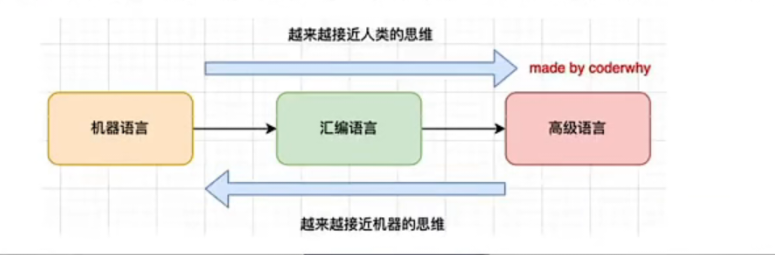
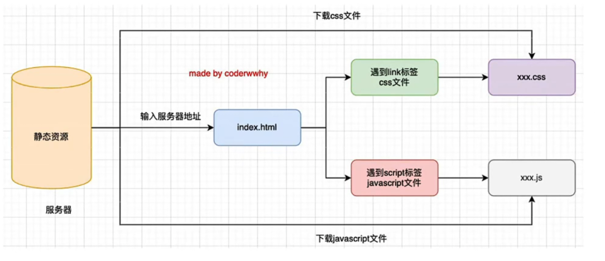
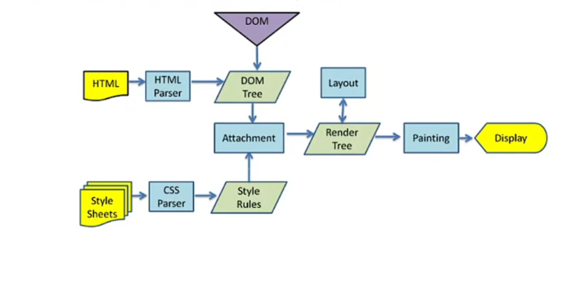

## 前端需要掌握的三大技术

前端开发最主要需要掌握的是三个知识点：HTML、CSS、JavaScript

- HTML：简单易学，掌握常用的标签即可
- CSS：CSS 属性规则较多，多做练习和项目
- JavaScript：上手容易，但是精通很难，学会它需要几分钟，掌握它需要很多年

## JavaScript 的重要性

**JavaScript 是前端万丈高楼的根基**

前端行业在近几年快速发展，并且开发模式、框架越来越丰富。

但是不管你学习的是Vue、React、Angular，包括 jQuery，以及一些新出的框架。

他们本身都是基于 JavaScript 的，使用他们的过程中你都必须好好掌握 JavaScript。

所以 JavaScript 是我们前端万丈高楼的根基，无论是前端发展的万丈高楼，还是我们筑建自己的万丈高楼。

**JavaScript 在工作中至关重要**

在工作中无论你使用什么样的技术，比如 Vue、React、Angular、uniapp、taro、ReactNative。

也无论你做什么平台的应用程序，比如 pc web、移动端 web、小程序、公众号、移动端 App。

它们都离不开 JavaScript，并且深入掌握 JavaScript 不仅可以提高我们的开发效率，也可以帮助我们快速解决在开发中遇到的各种问题。

所以往往在面试时(特别是高级岗位)，往往会考察更多面试者的 JavaScript 功底。

**前端的未来依然是 JavaScript**

在可预见的前端的未来中，我们依然是离不开 JavaScript 的。

目前前端快速发展，无论是框架还是构建工具，都像雨后春笋一样，琳琅满目。

而且框架也会进行不断的更新，比如 vue3、react18、vite2、TypeScript4.x。

前端开发者面对这些不断变化的内容，往往内心会有很多的焦虑，但是其实只要我们深入掌握了JavaScript，这些框架或者工具都是离不开 JavaScript 的。

## 著名的 Atwood 定律

Stack Overflow 的创立者之一的 Jeff Atwood 在 2007 年提出了著名的 Atwood 定律：

> Any application that can be written in JavaScript, will eventually be written in JavaScript.

## JavaScript 应用越来越广泛

- Web 开发
  - 原生 JavaScript
  - react 开发
  - vue 开发
  - angular 开发
- 移动端开发
  - ReactNative 
  - Weex
- 小程序端开发
  - 微信小程序
  - 支付宝小程序
  - uniapp
  - taro
- 桌面应用开发
  - Electron
  - VScode
- 后端开发
  - Node 环境
  - express、koa、egg.js

## JavaScript 让人迷惑的知识点

- 作用域
  - 作用域的理解
  - 作用域的提升
  - 块级作用域
  - 作用域链
  - AO、GO、VO 等概念
- 函数、闭包
  - 闭包的访问规则
  - 闭包的内存泄漏
  - 函数中 this 的指向 
- 面向对象
  - JavaScript 面向对象
  - 继承
  - 原型
  - 原型链
- ES 新特性
  - ES6、7、8、9、10、11、12 新特性 
- 其他一些知识点
  - 事件循环
  - 微任务
  - 宏任务
  - 内存管理
  - Promise
  - await
  - async
  - 防抖
  - 节流

## TypeScript 会取代 JavaScript 吗？

TypeScript 只是给 JavaScript 带来了类型的思维

- 因为 JavaScript 本身长期是没有对变量、函数等类型进行限制的
- 这可能给我们的项目带来某种安全隐患

在之后的 JavaScript 社区中出现了一系列的类型约束方案：

- 在 2014 年，Facebook 推出了 flow 来对 JavaScript 进行类型检查
- 同年，Mircrosoft 微软也推出了 TypeScript 1.0 版本
- 他们都致力于为 JavaScript 提供类型检查，而不是取代 JavaScript

并且在 TypeScript 的官方文档有这么一句话：源于 JavaScript，归于 JavaScript ！

- TypeScript 只是 JavaScript 的一个超集，在它的基础上进行了拓展
- 并且最终 TypeScript 还是需要转换成 JavaScript 代码才能真正运行的

当然我们不排除有一天 JavaScript 语言本身会加入类型检测，那么无论是 TypeScript，还是 Flow 都会退出历史舞台

## JavaScript 是一门编程语言

JavaScript 是一门高级的编程语言。

从编程语言发展历史来说，可以划分为三个阶段：

- 机器语言：1000100111011000，一些机器指令
- 汇编语言：mov ax，bx，一些汇编指令
- 高级语言：C、C++、Java、JavaScript、Python

计算机本身是不识别这些高级语言的，所以我们的代码最终还是需要被转换成机器指令。



## 浏览器的工作原理

JavaScript 代码，在浏览器中是如何被执行的？



## 认识浏览器内核

不同的浏览器有不同的内核组成

- **Gecko**：早期被 Netscape 和 Mozilla Firefox 浏览器使用
- **Trident**：微软开发，被 IE4~IE11 浏览器使用，但是 Edge 浏览器已经转向 Blink
- **Webkit**：苹果基于 KHTML 开发、开源的，用于 Safari，Google Chrome 之前也在使用
- **Blink**：是 Webkit 的一个分支，Google 开发，目前应用于 Google Chrome，Edge，Opera等

事实上，我们经常说的浏览器内核指的是**浏览器的排版引擎**：

**排版引擎**（layout engine）也称为**浏览器引擎**（browser engine）、**页面渲染引擎**（rendering engine）或**样板引擎**。

## 浏览器渲染过程

HTML 解析的时候遇到了 JavaScript 标签，会停止解析 HTML，而去加载和执行 JavaScript 代码



JavaScript 代码由谁来执行呢？

**JavaScript 引擎**

## 认识 JavaScript 引擎

**为什么需要 JavaScript 引擎？**

- 高级的编程语言都是需要转成最终的机器指令来执行的
- 编写的 JavaScript 无论是给浏览器还是 node 执行，最后都是需要被 cpu 执行的
- 但是 cpu 只认识自己的指令集，机器语言才能被 cpu 执行
- 所以需要 JavaScript 引擎将 JavaScript 代码翻译成 cpu 指令来执行

**比较常见的 JavaScript 引擎有哪些？**

- **SpiderMonkey**：第一款 JavaScript 引起，由 Brendan Eich 开发（也就是 JavaScript 作者）
- **Chakra**：微软开发，用于 IE 浏览器
- **JavaScriptCore**：WebKit 中的 JavaScript 引擎， Apple 公司开发
- **V8**：Google 开发的强大 JavaScript 引擎，也帮助 Chrome 从众多浏览器中脱颖而出

## 浏览器内核和 JS 引擎的关系

以 webkit 为例，webkit 事实上由两部分组成的

- **WebCore**：负责 HTML 解析、布局、渲染等等相关的工作
- **JavaScriptCore**：解析、执行 JavaScript 代码

## V8 引擎的原理

官方对 V8 引擎的定义：

- V8 是用 C++ 编写的 Google 开源高性能 JavaScript 和 WebAssembly 引擎，它用于 Chrome 和 Node.js 等
- 它实现 ECMAScript 和 WebAssembly，并在 Windows 7 或更高版本，macOS 10.12+ 和使用 x64，IA-32，ARM 或 MIPS 处理器的 Linux 系统上运行
- V8 可以独立运行，也可以嵌入到任何 C++ 应用程序中


## V8 引擎的架构

V8 引擎本身的源码非常复杂，大概有超过 100w 行 C++ 代码，通过了解它的架构，我们可以知道它是如何对 JavaScript 执行的：

**Parse** 模块会将 JavaScript 代码转换成 AST（抽象语法树），这是因为解释器并不直接认识 JavaScript代码

- 如果函数没有被调用，那么是不会被转换成 AST 的
- Parse 的 V8 官方文档：[https://v8.dev/blog/scanner](https://v8.dev/blog/scanner)

**Ignition** 是一个解释器，会将 AST 转换成 ByteCode（字节码）

- 同时会收集 TurboFan 优化所需要的信息（比如函数参数的类型信息，有了类型才能进行真实的运算）
- 如果函数只调用一次，Ignition 会执行解释执行 ByteCode
- Ignition 的 V8 官方文档：[https://v8.dev/blog/ignition-interpreter](https://v8.dev/blog/ignition-interpreter)

**TurboFan** 是一个编译器，可以将字节码编译为 CPU 可以直接执行的机器码

- 如果一个函数被多次调用，就会被标记为**热点函数**，那么就会经过 TurboFan 转换成优化的机器码，提高代码的执行性能
- 机器码实际上也会被还原为 ByteCode，这是因为后续执行函数的过程中，如果类型发生了变化（比如 sum 函数原来执行的是 number 类型，后来执行变成了 string 类型），之前优化的机器码并不能正确的处理运算，就会逆向的转换成字节码
- TurboFan 的 V8 的官方文档：[https://v8.dev/blog/turbofan-jit](https://v8.dev/blog/turbofan-jit)

## V8 引擎的解析图（官方）


## V8 执行的细节

JavaScript 源码是如何被解析（Parse 过程）的呢？

- Blink 将源码交给 V8 引擎
- Stream 获取到源码并且进行编码转换
- Scanner 会进行词法分析（lexical analysis），词法分析会将代码转换成 tokens
- 经过 Parser 和 PreParser，tokens 会被转换成 AST
  - Parser 就是直接将 tokens 转换成 AST 树架构
  - PreParser 称之为预解析，为什么需要预解析？
    -  这是因为并不是所有的 JavaScript 代码，在一开始时就会被执行，那么对所有的 JavaScript 代码进行解析，必然会影响网页的运行效率
    -  所以 V8 引擎就实现了 Lazy Parsing（延迟解析）的方案，它的作用是将不必要的函数进行预解析，也就是只解析暂时需要的内容，而对函数的全量解析是在函数被调用时才会进行
    -  比如我们在一个函数 outer 内部定义了另外一个函数 inner，那么 inner 函数就会进行预解析
- 生成 AST 树后，会被 Ignition 转成字节码（bytecode），之后的过程就是代码的执行过程

## JavaScript 的执行过程

假如我们有下面一段代码，它在 JavaScript 中是如何被执行的呢？

```js
var name = "kaimo"

console.log(num1)

var num1 = 20
var num2 = 30
var result = num1 + num2

console.log(result)
```

- 1、代码被解析，V8 引擎内部会帮助我们创建一个对象（GlobalObject 也称之为 GO）
- 2、运行代码
  - v8 为了执行代码，v8 引擎内部会有一个执行上下文栈（Execution Context Stack，ECStack）（函数调用栈）
  - 因为我们执行的是全局代码，为了全局代码能过正常执行，需要创建全局执行上下文（Global Execution Context）（全局代码需要被执行时才会创建）


## 初始化全局对象

js 引擎在执行代码之前，会在**堆内存中创建一个全局对象**：Global Object（GO）

- 该对象所有的作用域（scope）都可以访问
- 里面会包含 Date、Array、setTimeout等
- 其中还有一个 window 属性指向自己


## 执行上下文栈（调用栈）

js 引擎内部有一个**执行上下文栈**（Execution Context Stack，简称 ECS），它是用于执行代码的调用栈。

那么现在它要执行谁呢？执行的是全局的代码块：

- 全局的代码块为了执行会构建一个 Global Execution Context（GEC）
- GEC 会被放入到 ECS 中执行

GEC 被放入到 ECS 中里面包含两部分内容：

- 第一部分：在代码执行前，在 parser 转成 AST 的过程中，会将全局定义的变量、函数等加入到 GlobalObject 中，但是并不会赋值，这个过程也称之为变量的作用域提升（hoisting）
- 第二部分：在代码执行中，对变量赋值，或者执行其他的函数