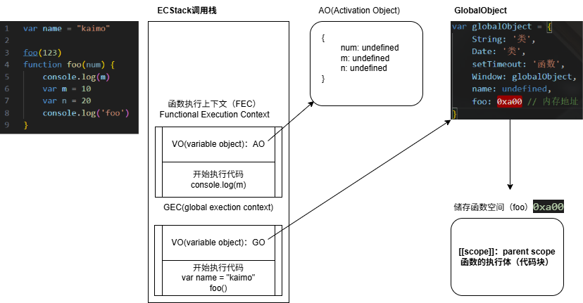
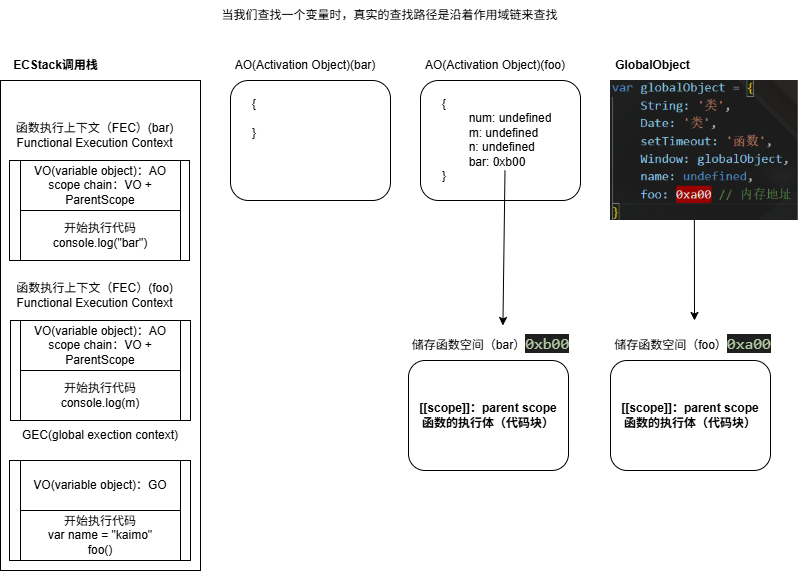
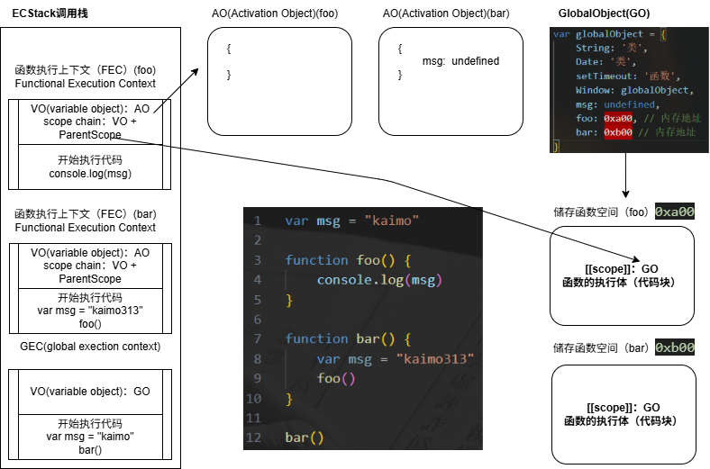
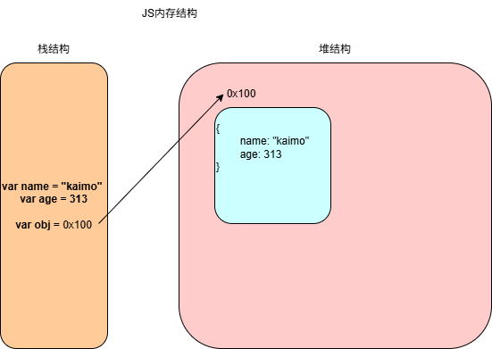
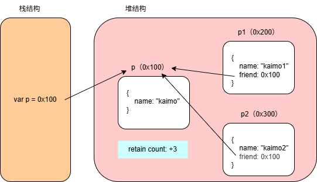
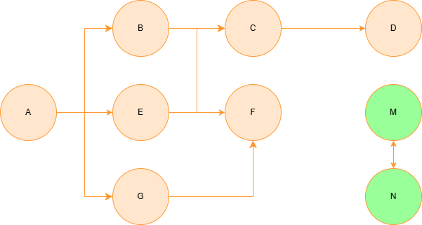

## 全局代码执行过程-函数

```js
var name = "kaimo"

foo(123)
function foo(num) {
    console.log(m)
    var m = 10
    var n = 20
    console.log('foo')
}
```



## 全局代码执行过程-函数嵌套

当我们查找一个变量时，真实的查找路径是沿着作用域链来查找

```js
var name = "kaimo"

foo(123)
function foo(num) {
    console.log(m)
    var m = 10
    var n = 20
    console.log('foo')
    function bar() {
        console.log('bar')
    }
    bar()
}
```



## 函数调用函数执行过程

```js
var msg = "kaimo"

function foo() {
    console.log(msg)
}

function bar() {
    var msg = "kaimo313"
    foo()
}

bar()
```



## 变量环境和变量记录

其实我们上面讲解的（AO/GO/VO）都是基于早期 ECMA 的版本(ECMAScript 5以前)规范：

> Every execution context has associated with it a variable object, Variables and functions declared in the source text are added as properties of the variable object, For function code, parameters are added as properties of the variable object.

> 每一个执行上下文会被关联到一个变量对象（variable object， VO），在源代码中的变量和函数声明会被作为属性添加到 VO 中，对于函数来说，参数也会被添加到 VO 中。 

在最新的 ECMA 的版本规范中，对于一些词汇进行了修改：

> Every execution context has an associated VariableEnvironment, Variables and functions declared in ECMAScript code evaluated in an execution context are added as bindings in that VariableEnvironment's Environment Record, For function code, parameters are also added as bindings to that Environment Record.

> 每一个执行上下文会被关联到一个变量环境（VariableEnvironment，VE）中，在执行代码中变量和函数的声明会作为环境记录（Environment Record，ER）添加到变量环境中，对于函数来说，参数也会被作为环境记录添加到变量环境中。

通过上面的变化我们可以知道，在最新的 ECMA 标准中，我们前面的变量对象 VO 已经有了另外一个称呼了：变量环境 VE。

## 作用域提升面试题

面试题一

```js
var n = 100
function foo() {
    n = 200
}
foo()

console.log(n)
```

面试题二

```js
function foo() {
    console.log(n)
    var n = 200
    console.log(n)
}
var n = 100
foo()
```

面试题三

```js
var n = 100
function foo1() {
    console.log(n)
}
function foo2() {
    var n = 200
    console.log(n)
    foo1()
}

foo2()
console.log(n)
```

面试题四

```js
var a = 100
function foo() {
    console.log(a)
    return
    var a = 100
}
foo()
```

面试题五

```js
function foo() {
    var a = b = 100
}

foo()

console.log(b)
console.log(a)
```

这里的 

```js
var a = b = 100
// 转成下面两行代码
var a = 100
b = 100 // 没有 var，这个时候 JS 引擎会特殊处理这种，将 b 加到 GO
```

## 认识内存管理

不管什么样的编程语言，在代码的执行过程中都是需要给它分配内存的，不同的是某些编程语言需要我们自己手动的管理内存，某些编程语言可以自动帮助我们管理内存。

不管以什么样的方式来管理内存，内存的管理都会有如下的生命周期：

- 第一步：分配申请你需要的内存（申请）
- 第二步：使用分配的内存（存放一些东西，比如对象等）
- 第三步：不需要使用时，对其进行释放

不同的编程语言对于第一步和第三步有不同的实现：

- 手动管理内存：比如 C、C++，包括早期的 OC，都是需要手动来管理内存的申请和释放的（malloc 和 free 函数）
- 自动管理内存：比如 Java、JavaScript、Python、Swift、Dart 等，它们有自动帮助我们管理内存

我们可以知道 JavaScript 通常情况下是不需要手动来管理的。

## JS 的内存管理

JavaScript 会在定义变量时为我们分配内存。

内存分配方式：

- JS 对于**基本数据类型**内存的分配会在执行时，直接在**栈空间**进行分配
- JS 对于**复杂数据类型**内存的分配会在**堆内存**中开辟一块空间，并且将这块空间的指针返回值给变量引用



## JS 的垃圾回收

因为内存的大小是有限的，所以当内存不再需要的时候，我们需要对其进行释放，以便腾出更多的内存空间。

在手动管理内存的语言中，我们需要通过一些方式自己来释放不再需要的内存，比如 free 函数：

- 但是这种管理的方式其实非常的低效，影响我们编写逻辑的代码效率
- 并且这种方式对开发者的要求也很高，并且一不小心就会产生内存泄漏

所以大部分现代的编程语言都是有自己的垃圾回收机制：

- 垃圾回收（Garbage Collection），简称 GC
- 对于那些**不再使用的对象**，我们都称之为是**垃圾**，它需要被**回收**，以释放更多的内存空间
- 而我们的语言运行环境，比如 Java 的运行环境 JVM，JavaScript 的运行环境 js 引擎都会有**垃圾回收器**
- 垃圾回收器我们也会简称为 GC，所以在很多地方你看到 GC 其实指的是垃圾回收器

GC 怎么知道那些对象是不再使用的呢？这里就要用到 GC 算法了。

## 常见的 GC 算法-引用计数

当一个对象有一个引用指向它时，那么这个对象的引用就 +1, 当一个独享的引用为 0 时，这个对象就可以被销毁掉

```js
var p = {
    name: "kaimo"
}

var p1 = {
    name: "kaimo1",
    friend: p
}

var p2 = {
    name: "kaimo2",
    friend: p
}
```



引用计数存在一个很大的弊端：循环引用

```js
var obj1 = {
    friend: obj2
}

var obj2 = {
    friend: obj1
}
```

这样相互引用会导致内存泄漏

## 常见的 GC 算法-标记清除

标记清除这个算法是设置一个根对象（root object），垃圾回收器会定期从这个根开始，找所有从根开始有引用到的对象，对于哪些没有引用到的对象，就认为是不可用的对象

这个算法可以很好的解决循环引用的问题
 


JS 引擎比较广泛采用的就是标记清除算法，当然类似于 V8 引擎为了进行更好的优化，它在算法的实现细节上也会结合一些其他的算法。