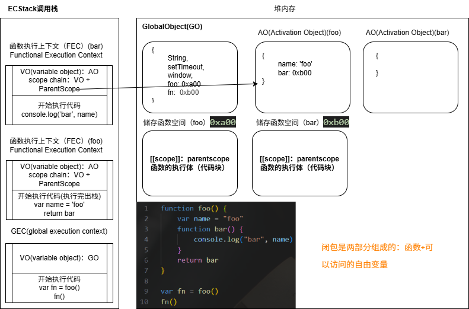

## 让人迷惑的闭包

闭包是 JavaScript 中一个非常容易让人迷惑的知识点

> 对于那些有一点 JavaScript 使用经验但从未真正理解闭包概念的人来说，理解闭包可以看作是某种意义上的重生，但是需要付出非常多的努力和牺牲才能理解这个概念。

>  回忆我前几年的时光，大量使用 JavaScript 但却完全不理解闭包是什么，总感觉这门语言有其隐蔽的一面，如果能够掌握将会功力大涨，但讽刺的是我始终无法掌握其中的门道，还记得我曾经大量阅读早期框架的源码，试图能够理解闭包的工作原理，现在还能回忆起我的脑海中第一次浮现出关于“模块模式”相关概念时的激动心情。

闭包确实是 JavaScript 中一个很难理解的知识点，接下来我们就对其一步步来进行剖析，看看它到底有什么神奇之处。

## JS 中函数是一等公民

在 JavaScript 中，函数是非常重要的，并且是一等公民

- 意味着函数的使用是非常的灵活的
- 函数可以作为另外一个函数的参数，也可以作为另外一个函数的返回值来使用

将函数作为另外一个函数的参数

```js
function foo(a) {
    a()
}

function bar() {
    console.log('bar')
}

foo(bar)


function calc(num1, num2, calcFn) {
    console.log(calcFn(num1, num2))
}

function add(num1, num2) {
    return num1 + num2
}

function sub(num1, num2) {
    return num1 - num2
}

function mul(num1, num2) {
    return num1 * num2
}

var m = 30
var n = 20

calc(m, n, add)
calc(m, n, sub)
calc(m, n, mul)
```

函数作为返回值的使用

```js
// js 语法允许函数内部再定义函数
function foo() {
    function bar() {
        console.log('bar')
    }
    return bar
}

var fn = foo()
fn()

function makeAdder(count) {
    function add(num) {
        return count + num
    }
    return add
}

var add5 = makeAdder(5)
add5(6)
var add10 = makeAdder(10)
var add100 = makeAdder(100)
```

**高阶函数**：一个函数如果接收另外一个函数作为参数，或者该函数会返回另外一个函数作为返回值，那么这个函数就称之为是一个高阶函数。

数组中的函数使用

```js
// 把数组里面的偶数都挑出来
var nums = [10, 5, 11, 100, 55]

var newNums = []
for (var i = 0; i < nums.length; i++) {
    var num = nums[i]
    if(num % 2 === 0) {
        newNums.push(num)
    }
}
console.log(newNums)

// 函数 function：独立的 function，我们称之为是一个函数
// 方法 method：当我们的一个函数属于某一个对象时，我们称这个函数是这个对象的方法

// 数组中的高阶函数
// 1、filter：过滤
var newNums2 = nums.filter(function(item) {
    return item % 2 === 0
})
// 2、map：映射
var newNums3 = nums.map(function(item) {
    return item * 10
})
///3、forEach：迭代
nums.map(function(item) {
    console.log(item)
})
// 4、find/findIndex：查找
var item = nums.find(function(item) {
    return item === 11
})
// 5、reduce：累加
nums.reduce((previousValue, currentValue, currentIndex, array) => {
    return previousValue + currentValue
}, 0)
```

## JS 中闭包的定义

闭包的概念出现于 60 年代，最早实现闭包的程序是 Scheme，那么我们就可以理解为什么 JavaScript 中有闭包：因为 JavaScript 中大量的设计是来源于 Scheme 的

### 在计算机科学中对闭包的定义（维基百科）

- 闭包（Closure）又称为**词法闭包**（Lexical Closure）或**函数闭包**（function closures）
- 是在支持**头等函数**的编程语言中，实现**词法绑定**的一种技术
- 闭包在实现上是一个结构体，它存储了一个函数和一个关联的环境（相当于一个符号查找表）
- 闭包跟函数最大的区别在于，当捕捉闭包的时候，它的**自由变量**会在捕捉时被确定，这样即使脱离了捕捉时的上下文，它也能照常运行

### MDN 对 JavaScript 闭包的解释

- 一个函数和对其周围状态（lexical environment，词法环境）的引用捆绑在一起（或者说函数被引用包围），这样的组合就是闭包（closure）
- 也就是说，闭包让你可以在一个内层函数中访问到外层函数的作用域
- 在 JavaScript 中，每当创建一个函数，闭包就会在函数创建的同时被创建出来

### 老师的总结和理解

- 一个普通的函数，如果它可以访问外层作用域的**自由变量**，那么这个函数就是一个闭包
- 从广义的角度来说：JavaScript 中的函数都是闭包
- 从狭义的角度来说：JavaScript 中一个函数，如果访问了外层作用域的变量，那么它是一个闭包

### 个人拓展

> 自由变量（Free Variable） 是指在函数中使用，但既不是函数参数，也不是在函数内部声明的变量。

变量分类:

- 绑定变量（Bound Variable）
  - 函数参数
  - 函数内声明的变量（let、const、var）

- 自由变量（Free Variable）
  - 来自外层作用域的变量
  - 来自全局作用域的变量

```js
function foo() {
    var name = "foo"
    function bar() {
        console.log("bar", name)
    }
    return bar
}

var fn = foo()
fn()
```



## 闭包的内存的泄漏

闭包会造成内存泄漏，其实就是引用链中的所有对象无法释放。

只要将下面的 fn 设置为 null，在 GC 的下一次检测中，它们就会被销毁掉

```js
function foo() {
    var name = 'foo'
    var age = 18

    function bar() {
        console.log(name)
        console.log(age)
    }
    return bar
}

var fn = foo()
fn()

// 解决内存泄漏
fn = null // 让 fn 指向一个 0x0 的地址
```

