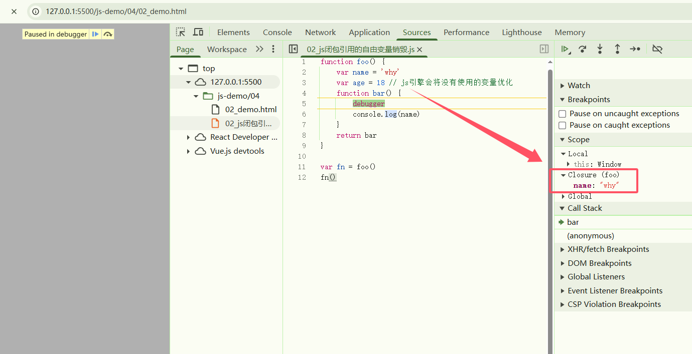
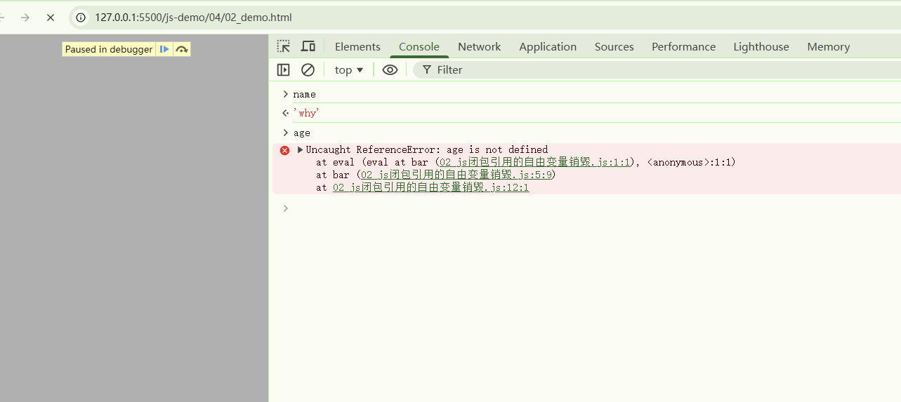
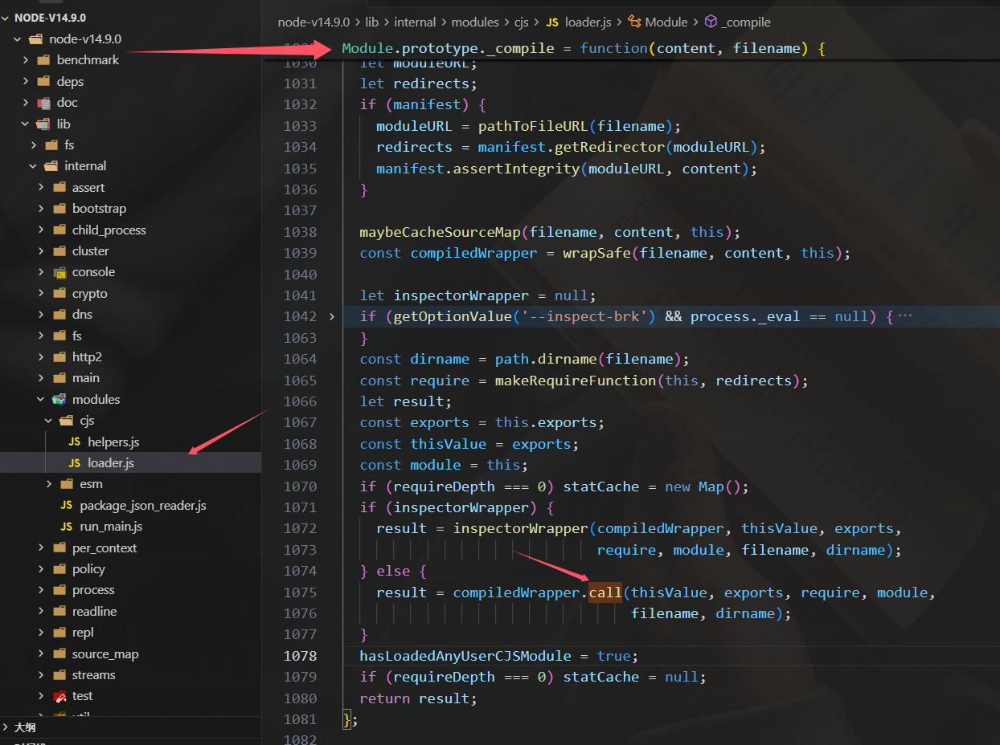

## 闭包的内存泄漏测试

```html
<!DOCTYPE html>
<html lang="en">
<head>
    <meta charset="UTF-8">
    <meta name="viewport" content="width=device-width, initial-scale=1.0">
    <title>Document</title>
</head>
<body>
    <script src="./01_js闭包内存泄漏案例.js"></script>
</html>
```

```js
function createFnArray() {
    // 整数占据 4 个字节
    // arr 占据内存大小：1024 * 1024 * 4 = 4M
    var arr = new Array(1024 * 1024).fill(1)
    return function() {
        console.log(arr.length)
    }
}

var arrayFns = []
for(var i = 0; i < 100; i++) {
    setTimeout(() => {
        arrayFns.push(createFnArray())
    }, i * 100)
}

setTimeout(() => {
    for(var i = 0; i < 50; i++) {
        setTimeout(() => {
            arrayFns.pop()
        }, i * 100)
    }
}, 100 * 100)
```

打开浏览器的开发者工具，找到性能模块然后点击录制，我这里录制了40s，由于浏览器的一些干扰因素影响可能不太准确，可自行多录制几次，大致的内存变化就是1-10s 开始慢慢增加内存到 4M，然后 10-15s 过程中数组断开一半的引用，然后由 GC 算法统一回收，内存降到 2M。


## 闭包引用的自由变量销毁

```js
function foo() {
    var name = 'why'
    var age = 18 // js引擎会将没有使用的变量销毁
    function bar() {
        debugger
        console.log(name)
    }
    return bar
}

var fn = foo()
fn()
```



打了 debugger 之后，我们可以在控制台输入 name，以及 age，可以看到 age 是访问报错的



## 为什么需要 this

在常见的编程语言中，几乎都有 this 这个关键字（Objective-C 中使用的是 self）， 但是 JavaScript 中的 this 和常见的面向对象语言中的 this 不太一样

- 常见面向对象的编程语言中，比如 Java、C++、Swift、Dart 等等一系列语言中，this 通常只会出现在类的方法中
- 也就是你需要有一个类，类中的方法（特别是实例方法）中，this 代表的是当前调用的对象
- 但是 JavaScript 中的 this 更加灵活，无论是它出现的位置还是它代表的含义

编写一个 obj 的对象，有 this 和没有 this 的区别

```js
// 从某种角度来说，开发中如果没有 this，很多问题我们也是有解决方案
// 但是没有 this，会让我们编写代码变得非常的不方便

var obj = {
    name: 'why',
    eating: function() {
        console.log(this.name + '在吃东西')
        console.log(obj.name + '在吃东西') // obj 一改动，里面用到 obj 的都要改
    },
    running: function() {
        console.log(this.name + '在跑步')
        console.log(obj.name + '在跑步')
    },
    studying: function() {
        console.log(this.name + '在学习')
        console.log(obj.name + '在学习')
    }
}
```

## this 指向什么

在大多数情况下，this 都是出现在函数中

在全局作用域下 this 的指向：

- 浏览器：window
- Node 环境：`{}`

node 环境里面的全局作用域的 this 为什么是 `{}`

> 在 Node.js 的“全局作用域”里看到的 this 并不是“真正的全局对象”，而是模块作用域里的 this。Node.js 在启动你的文件时，会把文件内容包进一个函数里执行，大致过程：`module -> 加载 -> 编译 -> 放到一个函数 -> 执行这个函数.call({})`，因此，在“文件顶层”打印 this 得到 `{}`，只是 Node 的模块封装机制带来的副作用，而不是浏览器里那种指向全局 window 的行为。



[https://registry.npmmirror.com/binary.html?path=node/v14.9.0/](https://registry.npmmirror.com/binary.html?path=node/v14.9.0/)

开发中直接在全局作用域下去使用 this，通常都是**在函数中使用**

- 所有的函数在被调用时，都会创建一个执行上下文
- 这个上文中记录着函数的调用栈、AO 对象等
- this 也是其中的一条记录

## this 到底指向什么

下面定义了一个函数，采用三种不同的方式对它进行调用，产生了三种不同的结果

```js
// this 指向什么，跟函数所处的位置没有关系
// 跟函数被调用的方式有关系
function foo() {
    console.log(this)
}

// 1. 直接调用这个函数
foo() // window

// 2. 创建一个对象，对象中的函数指向 foo
var obj = {
    name: 'why',
    foo: foo
}

obj.foo() // obj 对象

// 3. 通过 apply 调用
foo.apply('abc') // String {'abc'} 对象
```

这个案例给我们的启示：

- 函数在调用的时，JavaScript 会默认给这个 this 绑定一个值
- this 的绑定和定义的位置（编写的位置）没有关系
- this 的绑定和调用方式以及调用的位置有关系
- this 是在运行时被绑定的

## this 到底是怎么样的绑定规则

### 绑定规则一：默认绑定

什么情况下使用默认绑定？独立函数调用。

独立的函数调用我们可以理解成函数没有被绑定到某个对象上进行调用。

```js
// 案例1
function foo() {
    console.log(this)
}

foo()

// 案例2
function foo1() {
    console.log(this)
}
function foo2() {
    console.log(this)
    foo1()
}
function foo3() {
    console.log(this)
    foo2()
}

foo3()

// 案例3
var obj3 = {
    name: 'why',
    foo: function() {
        console.log(this)
    }
}
var bar3 = obj3.foo
bar3()

// 案例4
function foo4() {
    console.log(this)
}

var obj4 = {
    name: 'obj4',
    foo: foo4
}
var bar4 = obj4.foo
bar4()

// 案例5
function foo5() {
    function bar() {
        console.log(this)
    }
    return bar
}
var fn = foo5()
fn()
```

### 绑定规则二：隐式绑定

通过某个对象进行调用的：也就是它的调用位置中，是通过某个对象发起的函数的调用。

隐式绑定有一个前提条件：

- 必须在调用的对象内部有一个对函数的引用（比如一个属性）
- 如果没有这样的引用，在进行调用时，会报找不到该函数的错误
- 正是通过这个引用，间接的将 this 绑定到了这个对象上

```js
// 隐式绑定：object.fn()
// object 对象会被 js 引擎绑定到 fn 函数中的 this 里面

// 案例1
function foo() {
    console.log(this)
}
var obj = {
    name: 'why',
    foo: foo
}
obj.foo()

// 案例2
var obj2 = {
    name: 'why',
    eating: function() {
        console.log(this.name + '在吃东西')
    },
    running: function() {
        console.log(this.name + '在跑步')
    },
    studying: function() {
        console.log(this.name + '在学习')
    }
}

obj2.eating()
obj2.running()
obj2.studying()

// 案例3
var obj3 = {
    name: 'obj3',
    foo: function() {
        console.log(this)
    }
}
var obj4 = {
    name: 'obj4',
    bar: obj3.foo
}
obj4.bar()
```

### 绑定规则三：显示绑定

如果我们不希望在对象内部包含这个函数的引用，同时又希望在这个对象上进行强制调用，该怎么做？

- JavaScript 所有的函数都可以使用 call 和 apply 方法（这个和 Prototype 有关）
- 这两个函数的第一个参数都要求是一个对象，这个对象的作用是什么？就是给 this 准备的
- 在调用这个函数时，会将 this 绑定到这个传入的对象上

通过 call 或者 apply 绑定 this 对象，显示绑定后，this 就会明确的指向绑定的对象

```js
function foo() {
    console.log(this)
}

// foo 直接调用和 call/apply 调用的不同在于 this 绑定的不同
// foo 直接调用指向的是全局对象 window
foo()

var obj = {
    name: 'why'
}

// call/apply 是可以指定 this 的绑定对象
foo.apply(obj)
foo.call(obj)

// call/apply 在传参上有所区别
function sum(num1, num2) {
    console.log(num1 + num2, this)
}
sum.apply(obj, [10, 20])
sum.call(obj, 10, 20)

// call 和 apply 在执行函数时，是可以明确的绑定 this，这个绑定规则称之为显示绑定。
```

如果希望一个函数总是显示的绑定到一个对象上可以使用 bind

```js
function foo() {
    console.log(this)
}

// foo.call('kaimo')
// foo.call('kaimo')
// foo.call('kaimo')
// foo.call('kaimo')
// foo.call('kaimo')

// 默认绑定和显示绑定 bind 冲突：显示绑定优先级更高
var newFoo = foo.bind('kaimo')
newFoo()
newFoo()
newFoo()
newFoo()
newFoo()
```

### 绑定规则四：new 绑定

JavaScript 中的函数可以当做一个类的构造函数来使用，也就是使用 new 关键字

使用 new 关键字来调用函数时，会执行如下的操作：

- 1.创建一个全新的对象
- 2.这个新对象会被执行 prototype 链接
- 3.这个新对象会绑定到函数调用的 this 上（this 的绑定在这个步骤完成）
- 4.如果函数没有返回其他对象，表达式会返回这个新对象

```js
// 通过一个 new 关键字调用一个函数时（构造器），这个时候 this 是在调用这个构造器时创建出来的对象
// this = 创建出来的对象
// 这个绑定过程就是 new 绑定

function Person(name, age) {
    this.name = name
    this.age = age
    console.log(this)
}

var p1 = new Person('why', 18)
console.log('p1---->', p1)
var p2 = new Person('kaimo', 313)
console.log('p2---->', p2)
```