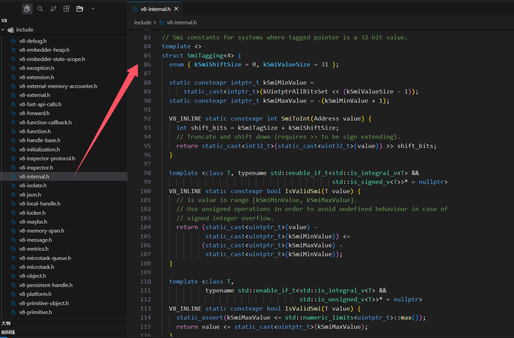

## 关于闭包内存泄漏案例说明

前面讲的案例里面说下面数组占据的大小是 4M，但是有同学有疑惑: `number 占据的大小不是 8 byte，不应该是 8M 吗？`

```js
function createFnArray() {
    // 整数占据 4 个字节
    // arr 占据内存大小：1024 * 1024 * 4 = 4M
    var arr = new Array(1024 * 1024).fill(1)
    return function() {
        console.log(arr.length)
    }
}
```

**为什么是 4M 而不是 8M？这涉及到 V8 引擎的内存优化机制**：下面是我通过 ai 以及老师总结的梳理

1. JavaScript Number 类型的理论大小
   - JavaScript 中的 `number` 类型在规范上是 64 位浮点数（IEEE 754 双精度浮点数）
   - 理论上每个 number 应该占据 **8 字节**

2. V8 引擎的 SMI 优化
   - V8 引擎为了优化性能，引入了 **SMI（Small Integer）** 优化机制
   - SMI 范围：`-2³¹` 到 `2³¹-1`（即 -2,147,483,648 到 2,147,483,647）
   - 对于在这个范围内的整数，V8 会使用 **32 位整数（4 字节）** 来存储，而不是 64 位浮点数

3. 数组元素类型优化
   - 当数组中的所有元素都是小整数时，V8 会将数组优化为 **Packed SMI Elements** 类型
   - 这样每个元素只需要 4 字节，而不是 8 字节
   - `fill(1)` 填充的是整数 1，属于 SMI 范围，所以每个元素占据 4 字节

4. 内存计算
   - 数组长度：1024 × 1024 = 1,048,576 个元素
   - 每个元素：4 字节（SMI 优化）
   - 总内存：1,048,576 × 4 = 4,194,304 字节 ≈ **4MB**

**SMI 工作原理**

V8 在内部使用标记位（标记指针）（tagged pointer）来区分，用于在指针中嵌入类型信息：
- SMI 存储：将整数左移 1 位（乘以 2），最低位设为 0 作为标记，直接放在指针位置。
- 非 SMI：最低位设为 1，其余位存储指向堆对象的真实指针。

对比示例

```js
// 情况 1：SMI（小整数）
var a = 1
存储：指针值 = (1 << 1) | 0 = 2
二进制：...0010  ← 最低位 = 0（表示这是 SMI）
读取：值 = 2 >> 1 = 1

// 情况 2：非 SMI（大整数或浮点数）
var b = 2147483648
步骤：
  1. 在堆中分配 8 字节：地址 = 0x12345678
  2. 存储数字到堆中
  3. 指针值 = 0x12345678 | 1 = 0x12345679
二进制：...1001  ← 最低位 = 1（表示这是指向堆对象的指针）
读取：
  1. 检查最低位：0x12345679 & 1 = 1（是真实指针）
  2. 恢复地址：0x12345679 & ~1 = 0x12345678
  3. 从堆地址读取 8 字节的值
```

示例：

```js
// ✅ SMI（4 字节）
var a = 1
var b = 100
var c = -100
var d = 2147483647  // SMI 最大值

// ❌ 非 SMI（8 字节）
var e = 2147483648  // 超出 SMI 范围
var f = 1.5         // 浮点数
var g = Infinity    // 特殊值
var h = NaN         // 特殊值
```

```js
// 使用大整数（超出 SMI 范围），会使用 8 字节
var arr1 = new Array(1024 * 1024).fill(2147483648) // 超出 SMI 范围
// 此时每个元素占据 8 字节，总内存约为 8M

// 使用浮点数，也会使用 8 字节
var arr2 = new Array(1024 * 1024).fill(1.5) // 浮点数
// 此时每个元素占据 8 字节，总内存约为 8M

// 使用小整数（SMI 范围），使用 4 字节
var arr3 = new Array(1024 * 1024).fill(1) // SMI 优化
// 此时每个元素占据 4 字节，总内存约为 4M
```

综上，这是 JavaScript 规范与引擎实现之间的差异，V8 引擎为了优化内存和性能而做的优化，属于引擎层面的实现细节

- **小整数（SMI）**：4 字节存储
- **大整数或浮点数**：8 字节存储

[v8 源码: https://github.com/v8/v8](https://github.com/v8/v8)



## 内置函数的绑定

有些时候，我们会调用一些 JavaScript 的内置函数，或者一些第三方库中的内置函数

- 这些内置函数会要求我们传入另外一个函数
- 我们自己并不会显示的调用这些函数，而且 JavaScript 内部后者第三方库内部会帮助我们执行
- 这些函数中的 this 是如何绑定的？

```js
// 1.setTimeout
setTimeout(function() {
    console.log(this) // window
}, 2000)

// 2.监听点击
const boxDiv = document.querySelector('.box')
boxDiv.onclick = function() {
    console.log(this) // boxDiv
}
boxDiv.addEventListener('click', function() {
    console.log(this) // boxDiv
})

// 3.数组.forEach/map/filter/find
var names = ['a', 'b', 'c']
names.forEach(function(item) {
    console.log(item, this) // window
})
names.forEach(function(item) {
    console.log(item, this) // ['a', 'b', 'c']
}, names)
```

## 规则优先级

如果一个函数调用位置应用了多条规则，优先级谁更高？

**1、默认规则的优先级最低**

> 因为存在其他规则时，就会通过其他规则的方式来绑定 this

**2、显示绑定优先级高于隐式绑定**

```js
var obj = {
    name: 'obj',
    foo: function() {
        console.log(this)
    },
}

obj.foo() // obj

// call、apply 的优先级高于隐式绑定
obj.foo.call('kaimo') // String {'kaimo'}
obj.foo.apply('kaimo') // String {'kaimo'}

// bind 的优先级高于隐式绑定
function foo() {
    console.log(this)
}

var obj2 = {
    name: 'obj2',
    foo: foo.bind('kaimo2')
}
obj2.foo() // String {'kaimo2'}
```

**3、new 绑定优先级高于隐式绑定**

```js
var obj = {
    name: 'obj',
    foo: function() {
        console.log(this)
    },
}

// new 的优先级高于隐式绑定
var f = new obj.foo() // foo {}
```

**4、new 绑定优先级高于显示绑定**

```js
// 结论：new 关键字不能和 apply、call 一起来使用

function foo() {
    console.log(this)
}

// new 绑定优先级高于 bind 绑定
var bar = foo.bind('kaimo')

var obj = new bar() // foo {}

```

**new 绑定 > 显示绑定（apply、call、bind） > 隐式绑定（obj.foo()） > 默认绑定（独立函数调用）**

## this 规则之外 - 忽略显示绑定

如果在显示绑定中，我们传入一个 `null` 或者 `undefined`，那么这个现实绑定会被忽略，使用默认规则。

```js
function foo() {
    console.log(this)
}

// apply/call/bind 当传入 null、undefined 时，自动将 this 绑定成全局对象
foo.apply(null) // window
foo.call(undefined) // window

var bar = foo.bind(null)
bar() // window
```

## this 规则之外 - 间接函数使用

创建一个函数的间接引用，这种情况使用默认绑定规则。

```js
var obj1 = {
    name: 'obj1',
    foo: function() {
        console.log(this)
    }
};

var obj2 = {
    name: 'obj2'
};

// obj2.foo = obj1.foo;
// obj2.foo(); // obj2

// 间接调用：(obj2.foo = obj1.foo)() 实际上是在调用返回的函数引用，而不是作为对象的方法调用
// 属于独立函数调用
(obj2.foo = obj1.foo)(); // window
```

## 箭头函数 arrow function

箭头函数是 ES6 之后增加的一种编写函数的方法，并且它比函数表达式要更加简洁。

- 箭头函数**不会绑定 this、arguments 属性**
- 箭头函数**不能作为构造函数来使用**（不能和 new 一起来使用，会抛出错误）

箭头函数如何编写？

```js
// () 参数
// => 箭头
// {} 函数的执行体
var foo = (num1, num2, num3) => {

}

// 高阶函数在使用时，也可以传入箭头函数
[1, 2, 3].forEach(() => {});
```

## 箭头函数的编写优化

```js
// 常见的简写
// 简写1：如果参数只有一个，() 可以省略
[1, 2, 3].forEach(item => {
    console.log(item)
});

// 简写2：如果函数执行体只有一行代码，{} 可以省略，并且它会默认将这行代码的执行结果作为返回值
[1, 2, 3].forEach(item => console.log(item));
var newNums = [1, 2, 3].filter(item => item % 2 === 0)
var result = [1, 2, 3].filter(item => item % 2 === 0).map(item => item * 100).reduce((preValue, item) => preValue + item)

// 简写3：如果一个箭头函数只有一行代码，并且返回一个对象，这个时候如何编写简写
var bar = () => ({ name: 'kaimo313', age: 18 })
```

## this 规则之外 - ES6 箭头函数

箭头函数不使用 this 的四种标准规则（也就是不绑定 this），而是根据外层作用域来决定 this。

```js
// 1、测试箭头函数中的 this 指向
var name = 'kaimo'

var foo = () => {
    console.log(this)
}

foo() // window
var obj = { foo: foo }
obj.foo() // window
foo.call('kaimo313') // window

// 2、应用场景
var obj2 = {
    data: [],
    getData: function() {
        // 模拟发送网络请求，将结果放到 data 里面
        // 在箭头函数之前的解决方案
        // var _this = this
        // setTimeout(function() {
        //     var result = ['a', 'b', 'c']
        //     _this.data = result
        // }, 2000)
        setTimeout(() => {
            var result = ['a', 'b', 'c']
            this.data = result
        }, 2000)
    }
}
obj2.getData()
```

## 面试题一

```js
var name = "window"
var person = {
    name: "person",
    sayName: function() {
        console.log(this.name)
    }
}

function sayName() {
    var sss = person.sayName;
    sss(); // window 独立函数调用
    person.sayName(); // person 隐式调用
    (person.sayName)(); // person 隐式调用
    (b = person.sayName)(); // window 赋值表达式（独立函数调用）
}

sayName();
```

## 面试题二

```js
var name = "window";

var person1 = {
    name: "person1",
    foo1: function() {
        console.log(this.name)
    },
    foo2: () => console.log(this.name),
    foo3: function() {
        return function() {
            console.log(this.name)
        }
    },
    foo4: function() {
        return () => {
            console.log(this.name)
        }
    }
}

var person2 = {
    name: "person2"
}

person1.foo1(); // person1 隐式绑定
person1.foo1.call(person2); // person2 显示绑定优先级大于隐式绑定

person1.foo2(); // window 不绑定作用域，上层作用域是全局
person1.foo2.call(person2); // window

person1.foo3()(); // window 独立函数调用
person1.foo3.call(person2)(); // window 独立函数调用
person1.foo3().call(person2); // person2 最终调用返回函数时，使用的是显示绑定

person1.foo4()(); // person1 箭头函数不绑定this，上层作用域this是person1
person1.foo4.call(person2)(); // person2 上层作用域被显示的绑定了一个person2
person1.foo4().call(person2); // person1 箭头函数不绑定this，上层作用域this是person1
```

## 面试题三

```js
var name = "window";

function Person(name) {
    this.name = name;
    this.foo1 = function() {
        console.log(this.name)
    }
    this.foo2 = () => console.log(this.name);
    this.foo3 = function () {
        return function () {
            console.log(this.name)
        }
    }
    this.foo4 = function () {
        return () => {
            console.log(this.name)
        }
    }
}

var person1 = new Person('person1');
var person2 = new Person('person2');

person1.foo1(); // person1 隐式绑定
person1.foo1.call(person2); // person2 显示绑定优先级大于隐式绑定

person1.foo2(); // person1 箭头函数不绑定this，上层作用域this是person1
person1.foo2.call(person2); // person1 箭头函数不绑定this，上层作用域this是person1

person1.foo3()(); // window 独立函数调用
person1.foo3.call(person2)(); // window
person1.foo3().call(person2); // person2

person1.foo4()(); // person1
person1.foo4.call(person2)(); // person2
person1.foo4().call(person2); // person1 箭头函数不受 call 影响，仍然指向词法作用域中的 person1
```

## 面试题四

```js
var name = "window";

function Person(name) {
    this.name = name;
    this.obj = {
        name: 'obj',
        foo1: function () {
            return function () {
                console.log(this.name)
            }
        },
        foo2: function () {
            return () => {
                console.log(this.name)
            }
        }
    }
}

var person1 = new Person('person1');
var person2 = new Person('person2');

person1.obj.foo1()(); // window
person1.obj.foo1.call(person2)(); // window
person1.obj.foo1().call(person2); // person2

person1.obj.foo2()(); // obj
person1.obj.foo2.call(person2)(); // person2
person1.obj.foo2().call(person2); // obj
```