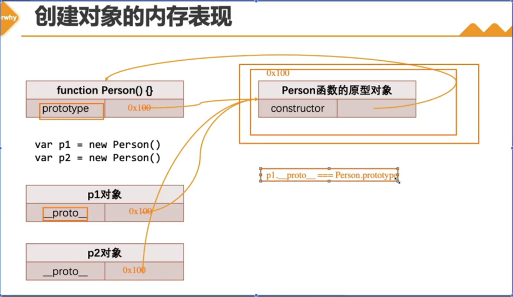

## 定义多个属性描述符

```js
var obj = {
    // 私有属性（js里面没有严格意义的私有属性，社区规范，以下划线开头）
    _age: 18,
    _eating: function () {},
    // 下面的写法enumerable、configurable默认是true
    // get age() {
    //     return this._age
    // },
    // set age(value) {
    //     this._age = value
    // }
}

Object.defineProperties(obj, {
    name: {
        value: '张三',
        writable: true,
        enumerable: true,
        configurable: true
    },
    age: {
        enumerable: false,
        configurable: false,
        get: function () {
            return this._age
        },
        set: function (value) {
            this._age = value
        }
    },
})
```

## 对象方法补充

### 获取属性描述符

```js
var obj = {
    _age: 18,
    _eating: function () {}
}

Object.defineProperties(obj, {
    name: {
        value: '张三',
        writable: true,
        enumerable: true,
        configurable: true
    },
    age: {
        enumerable: false,
        configurable: false,
        get: function () {
            return this._age
        },
        set: function (value) {
            this._age = value
        }
    },
})

// 获取属性描述符
console.log(Object.getOwnPropertyDescriptor(obj, 'name'))
console.log(Object.getOwnPropertyDescriptor(obj, 'age'))

// 获取所有属性描述符
console.log(Object.getOwnPropertyDescriptors(obj))
```

### Object的方法对对象限制

```js
var obj = {
    name: '张三',
    age: 18
}

// 禁止对象添加新的属性
Object.preventExtensions(obj) 

obj.height = 180
obj.address = '北京'

console.log(obj);

// 禁止对象配置/删除里面的属性
// for(var key in obj) {
//     Object.defineProperty(obj, key, {
//         configurable: false,
//         enumerable: true,
//         writable: true,
//         value: obj[key]
//     })
// }
Object.seal(obj)

delete obj.name

console.log(obj);

// 让属性不可修改（writable：false）
Object.freeze(obj)

obj.age = 20

console.log(obj);
```

## 创建多个对象的方案

- `new Object` 方式
- 字面量

创建同样的对象时，需要编写重复的代码

```js
var p1 = {
    name: '张三',
    age: 18,
    height: 1.88,
    address: '北京',
    eating: function () {
        console.log(this.name + '正在吃东西');
    },
    running: function () {
        console.log(this.name + '正在跑步');
    }
}

var p2 = {
    name: '李四',
    age: 18,
    height: 1.88,
    address: '北京',
    eating: function () {
        console.log(this.name + '正在吃东西');
    },
    running: function () {
        console.log(this.name + '正在跑步');
    }
}
```

### 创建对象的方案-工厂模式

一种常见的设计模式，通常会有一个工厂方法，通过该方法可以创建想要的对象。

```js
function createPerson(name, age, height, address) {
    var obj = {};
    obj.name = name;
    obj.age = age;
    obj.height = height;
    obj.address = address;

    obj.eating = function () {
        console.log(this.name + '正在吃东西');
    },
    obj.running = function () {
        console.log(this.name + '正在跑步');
    }
    return obj;
}

var p1 = createPerson('张三', 18, 1.88, '北京');
var p2 = createPerson('李四', 20, 1.68, '上海');

// 工厂模式的缺点：获取不到对象最真实的类型
console.log(p1, p2);
```


### 认识构造函数

构造函数也称之为`构造器（constructor）`，通常是我们在创建对象时回调用的函数。

如果一个普通的函数，使用 new 操作符去调用，那么这个函数就是一个构造函数。

```js
function foo() {
    console.log('foo');
}

// foo 就是一个普通的函数
foo()

// 换一种方式来调用 foo 函数：通过 new 关键字去调用一个函数，那么这个函数就是一个构造函数
new foo
new foo()
```

### new 操作符调用的作用

- 1. 在内存中创建一个新的对象（空对象）
- 2. 这个对象内部的 `[[prototype]]` 属性会被赋值为该构造函数的 `prototype` 属性
- 3. 构造函数内部的 this，会指向创建出来的新对象
- 4. 执行函数的内部代码（函数体代码）
- 5. 如果构造函数没有返回非空对象，则返回创建出来的新对象

### 创建对象方案-构造函数

约定：构造函数的首字母要大写

```js
function Person(name, age, height, address) {
    this.name = name;
    this.age = age;
    this.height = height;
    this.address = address;

    this.eating = function () {
        console.log(this.name + '正在吃东西');
    },
    this.running = function () {
        console.log(this.name + '正在跑步');
    }
}

var p1 = new Person('张三', 18, 1.88, '北京');
var p2 = new Person('李四', 20, 1.68, '上海');

console.log(p1, p2);

console.log(p1.__proto__.constructor.name); // Person
```

### 构造函数的缺点

每次调用构造函数都会创建新的函数空间

```js
function foo() {
    function bar() {

    }
    return bar;
}

var fn1 = foo()
var fn2 = foo()

// 每次调用构造函数都会创建新的函数空间
console.log(fn1 === fn2) // false
```

### 认识对象的原型

JavaScript 当中每个对象都有一个特殊的内置属性 `[[prototype]]`，这个特殊的对象可以指向另外一个对象。

每个对象中都有一个 `[[prototype]]` 属性，这个属性可以称之为对象的原型（**隐式原型**）。

**原型有什么用？**

当我们从一个对象中获取某一个属性时，它会触发 [[Get]] 操作

- 1、在当前对象中查找是否有对应的属性，如果找到就直接使用
- 2、如果没有找到，就会去它的原型中查找 [[prototype]]

```js
var obj = { name: 'why' }; // [[prototype]]
var info = { }; // [[prototype]]

// 早期的 ECMA 是没有规范如何去查看的 [[prototype]] 属性

// 给对象中提供了一个属性，可以让我们查看一下这个原型对象（浏览器提供）

console.log(obj.__proto__); // [Object: null prototype] {}

// ES5 中增加了一个新方法：Object.getPrototypeOf
console.log(Object.getPrototypeOf(obj)); 

obj.__proto__.age = 18;
console.log(obj);
```

### 函数的原型 prototype

函数也是一个对象，它也是有 `[[prototype]]` 隐式原型

函数它因为是一个函数，所以它还会有一个`显示原型属`性，叫做 `prototype`。

```js
function foo() {

}

// 函数也是一个对象，它也是有 [[prototype]] 隐式原型
console.log(foo.__proto__);

// 函数它因为是一个函数，所以它还会有一个显示原型属性，叫做 prototype

console.log(foo.prototype);

var f1 = new foo();
var f2 = new foo();

// 这个对象内部的 `[[prototype]]` 属性会被赋值为该构造函数的 `prototype` 属性
f1.__proto__ === foo.prototype;
f2.__proto__ === foo.prototype;

Person.prototype.name = '张三'
p1.__proto__.name = '李四'

// 模拟
// function foo() {
//     this = {}
//     this.__proto__ = foo.prototype;
// }
```

### 创建对象的内存表现



### 函数原型上的属性

```js
function foo() {

}

// 1、constructor 属性
console.log(foo.prototype);
console.log(Object.getOwnPropertyDescriptors(foo.prototype));

// foo.prototype.constructor = 构造函数本身
console.log(foo.prototype.constructor === foo); // true
console.log(foo.prototype.constructor.name); // "foo"

// 2、可以添加自己的属性
foo.prototype.name = "张三";
foo.prototype.age = 18;
foo.prototype.say = function () {
    console.log("hello");
}

// 3、直接修改整个 prototype 对象
foo.prototype = {
    constructor: foo,
    name: "李四",
    age: 20
}

// 真实开发中我们可以通过 Object.defineProperty() 方法来添加 constructor 属性
Object.defineProperty(foo.prototype, "constructor", {
    enumerable: false,
    configurable: true,
    writable: true,
    value: foo
})
```

### 创建对象方案-原型和构造函数

```js
function Person(name, age, height, address) {
    this.name = name;
    this.age = age;
    this.height = height;
    this.address = address;
}

Person.prototype.eating = function () {
    console.log(this.name + '正在吃东西');
}
Person.prototype.running = function () {
    console.log(this.name + '正在跑步');
}

var p1 = new Person('张三', 18, 1.88, '北京');
var p2 = new Person('李四', 20, 1.68, '上海');

p1.eating();
p2.eating();
p1.running();
p2.running();
```